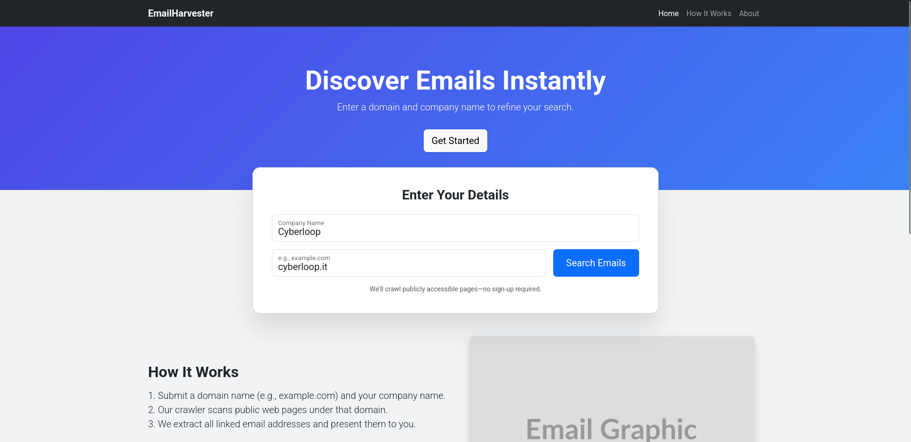
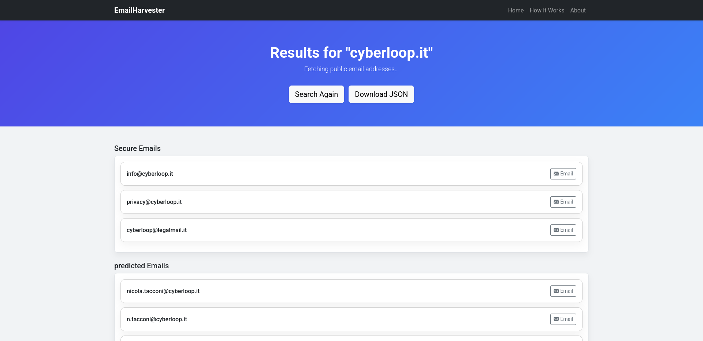

# 📧 Email Harvester 🕵️‍♂️

[](LICENSE)
[](docker-compose.yml)

This project is a web application designed to harvest emails 🎯. It uses a Python backend for scraping and a Node.js frontend for the UI. Everything is neatly packaged with Docker! 🐳

## ✨ Features

-   🔍 Scrapes websites for email addresses.
-   ⚙️ Asynchronous backend processing.
-   📊 Emails categorized as 'secure' and 'predicted'.
-   🖥️ Simple web interface.
-   🐳 Dockerized for easy setup.

## 🛠️ Prerequisites

-   Docker
-   Docker Compose

## 🚀 Getting Started

1.  **Clone the repository:**
    ```bash
    git clone https://github.com/Mark-74/emailHarvester.git
    cd emailHarvester
    ```

2.  **Build and run with Docker Compose:**
    ```bash
    docker-compose up -d --build
    ```

3.  **Access the application:**
    Open your web browser and go to `http://localhost:3000` 🎉.

## 🖼️ Screenshots

**Main Page**


**Results Page**


## 🤝 Contributing

Pull requests are welcome! For major changes, please open an issue first to discuss what you'd like to change.

## 📜 License

This project is licensed under the terms of the [LICENSE](LICENSE) file.
